# Thuto - Gamified Learning ERD

## Target Backend Schema

This ERD describes the redesign: learning paths contain modules, modules contain short lessons, lessons contain ordered interactive steps, and steps can include tasks. Student completion is tracked through attempts, progress, XP, streaks, and achievements instead of video watching.

```mermaid
erDiagram
    USER {
        ObjectId _id PK
        String firstName
        String lastName
        String email UK
        String password
        String role "Student|Admin|Tutor"
        Boolean isVerified
        String profileImage
        Date createdAt
        Date updatedAt
    }

    REFRESH_TOKEN {
        ObjectId _id PK
        ObjectId user FK
        String tokenHash
        String jwtId
        Date expiresAt
        Date revokedAt
        String replacedBy
        Date createdAt
        String ip
        String userAgent
    }

    EMAIL_VERIFICATION_TOKEN {
        ObjectId _id PK
        ObjectId user FK
        String tokenHash
        String jwtId
        Date expiresAt
        Date revokedAt
        String replacedBy
        Date createdAt
        String ip
        String userAgent
    }

    RESET_PASSWORD_TOKEN {
        ObjectId _id PK
        ObjectId user FK
        String tokenHash
        String jwtId
        Date expiresAt
        Date revokedAt
        String replacedBy
        Date createdAt
        String ip
        String userAgent
    }

    CATEGORY {
        ObjectId _id PK
        String name UK
        String slug UK
        String description
        String icon
        String color
        Boolean isActive
        ObjectId parentCategory FK
        Number pathCount
        Number sortOrder
        Date createdAt
        Date updatedAt
    }

    LEARNING_PATH {
        ObjectId _id PK
        String title
        String slug UK
        ObjectId category FK
        String description
        String level "beginner|intermediate|advanced"
        String thumbnail
        Number estimatedMinutes
        Number totalXp
        String[] tags
        String[] outcomes
        Boolean isPublished
        ObjectId createdBy FK
        Date createdAt
        Date updatedAt
    }

    LEARNING_MODULE {
        ObjectId _id PK
        ObjectId path FK
        String title
        String description
        Number order
        Number requiredXpToUnlock
        Boolean isPublished
        Date createdAt
        Date updatedAt
    }

    LEARNING_LESSON {
        ObjectId _id PK
        ObjectId module FK
        String title
        String summary
        Number order
        Number xpReward
        Number estimatedMinutes
        Boolean isPublished
        Date createdAt
        Date updatedAt
    }

    LESSON_STEP {
        ObjectId _id PK
        ObjectId lesson FK
        String type "explanation|multiple_choice|fill_blank|code|matching|ordering"
        String title
        String prompt
        String content
        Number order
        Boolean isCheckpoint
        Date createdAt
        Date updatedAt
    }

    TASK {
        ObjectId _id PK
        ObjectId step FK
        String type "multiple_choice|fill_blank|code|matching|ordering"
        String question
        String instructions
        String[] options
        Mixed correctAnswer
        String explanation
        Number xpReward
        Number maxAttempts
        Number sortOrder
        Date createdAt
        Date updatedAt
    }

    PATH_ENROLLMENT {
        ObjectId _id PK
        ObjectId student FK
        ObjectId path FK
        String status "active|completed|paused"
        Date startedAt
        Date completedAt
        ObjectId currentLesson FK
        Date createdAt
        Date updatedAt
    }

    USER_PROGRESS {
        ObjectId _id PK
        ObjectId student FK
        ObjectId path FK
        ObjectId module FK
        ObjectId lesson FK
        ObjectId step FK
        String status "not_started|in_progress|completed"
        Number score
        Number xpEarned
        Date lastAccessedAt
        Date completedAt
        Date createdAt
        Date updatedAt
    }

    TASK_ATTEMPT {
        ObjectId _id PK
        ObjectId student FK
        ObjectId task FK
        ObjectId lesson FK
        Mixed submittedAnswer
        Boolean isCorrect
        Number xpEarned
        Date attemptedAt
        Date createdAt
        Date updatedAt
    }

    USER_GAMIFICATION {
        ObjectId _id PK
        ObjectId student FK
        Number totalXp
        Number level
        Number currentStreak
        Number longestStreak
        Date lastActivityDate
        Number hearts
        Date heartsRefilledAt
        Number dailyGoalXp
        Date createdAt
        Date updatedAt
    }

    ACHIEVEMENT {
        ObjectId _id PK
        String name UK
        String description
        String icon
        String type
        Object criteria
        Number points
        Boolean isActive
        String rarity "common|rare|epic|legendary"
        Date createdAt
        Date updatedAt
    }

    USER_ACHIEVEMENT {
        ObjectId _id PK
        ObjectId user FK
        ObjectId achievement FK
        Date earnedAt
        ObjectId relatedPath FK
        ObjectId relatedLesson FK
        ObjectId relatedTask FK
        Object metadata
        Date createdAt
        Date updatedAt
    }

    NOTIFICATION {
        ObjectId _id PK
        ObjectId recipient FK
        String title
        String message
        String type "learning|system|achievement|account"
        Boolean isRead
        String actionUrl
        ObjectId relatedPath FK
        ObjectId relatedLesson FK
        ObjectId relatedTask FK
        String priority "low|medium|high"
        Date expiresAt
        Date createdAt
        Date updatedAt
    }

    CERTIFICATE {
        ObjectId _id PK
        ObjectId student FK
        ObjectId path FK
        Date issueAt
        Number grade
        String certificateUrl
        Date createdAt
        Date updatedAt
    }

    REVIEW {
        ObjectId _id PK
        ObjectId student FK
        ObjectId path FK
        Number rating
        String title
        String comment
        Boolean isVerified
        Number helpful
        Boolean reported
        Date createdAt
        Date updatedAt
    }

    DISCUSSION {
        ObjectId _id PK
        String title
        String content
        ObjectId author FK
        ObjectId path FK
        ObjectId lesson FK
        ObjectId step FK
        String[] tags
        String category "question|discussion|announcement|help"
        String status "open|resolved|closed"
        Number views
        Boolean isPinned
        Boolean isLocked
        Date createdAt
        Date updatedAt
    }

    SUPPORT_TICKET {
        ObjectId _id PK
        String ticketNumber UK
        ObjectId user FK
        String subject
        String description
        String category "technical|learning_content|account|general"
        String priority "low|medium|high|urgent"
        String status "open|in_progress|waiting_for_user|resolved|closed"
        ObjectId assignedTo FK
        ObjectId relatedPath FK
        ObjectId relatedLesson FK
        ObjectId relatedTask FK
        String resolution
        Date resolvedAt
        ObjectId resolvedBy FK
        Number satisfactionRating
        String satisfactionComment
        Date createdAt
        Date updatedAt
    }

    COUPON {
        ObjectId _id PK
        String code UK
        String name
        String description
        String rewardType "bonus_xp|hearts_refill|streak_freeze"
        Number rewardValue
        Date validFrom
        Date validUntil
        Number usageLimit
        Number usedCount
        ObjectId[] applicablePaths FK
        ObjectId[] applicableCategories FK
        Object userRestrictions
        Boolean isActive
        ObjectId createdBy FK
        Date createdAt
        Date updatedAt
    }

    ANALYTICS {
        ObjectId _id PK
        Date date
        String type "daily|weekly|monthly"
        Object metrics
        Array categoryBreakdown
        Array topPaths
        Object retention
        Date createdAt
        Date updatedAt
    }

    USER ||--o{ LEARNING_PATH : creates
    USER ||--o{ REFRESH_TOKEN : authenticates_with
    USER ||--o{ EMAIL_VERIFICATION_TOKEN : verifies_email_with
    USER ||--o{ RESET_PASSWORD_TOKEN : resets_password_with
    USER ||--o{ PATH_ENROLLMENT : starts
    USER ||--o{ USER_PROGRESS : tracks
    USER ||--o{ TASK_ATTEMPT : submits
    USER ||--|| USER_GAMIFICATION : owns
    USER ||--o{ USER_ACHIEVEMENT : earns
    USER ||--o{ NOTIFICATION : receives
    USER ||--o{ REVIEW : writes
    USER ||--o{ DISCUSSION : starts
    USER ||--o{ SUPPORT_TICKET : opens
    USER ||--o{ COUPON : creates

    CATEGORY ||--o{ LEARNING_PATH : groups
    CATEGORY ||--o{ CATEGORY : contains
    CATEGORY ||--o{ COUPON : limits

    LEARNING_PATH ||--o{ LEARNING_MODULE : contains
    LEARNING_PATH ||--o{ PATH_ENROLLMENT : enrolled_by
    LEARNING_PATH ||--o{ USER_PROGRESS : tracked_by
    LEARNING_PATH ||--o{ CERTIFICATE : certifies
    LEARNING_PATH ||--o{ REVIEW : reviewed_by
    LEARNING_PATH ||--o{ DISCUSSION : discussed_in
    LEARNING_PATH ||--o{ SUPPORT_TICKET : referenced_by
    LEARNING_PATH ||--o{ COUPON : eligible_for

    LEARNING_MODULE ||--o{ LEARNING_LESSON : contains
    LEARNING_MODULE ||--o{ USER_PROGRESS : tracked_by

    LEARNING_LESSON ||--o{ LESSON_STEP : contains
    LEARNING_LESSON ||--o{ USER_PROGRESS : tracked_by
    LEARNING_LESSON ||--o{ TASK_ATTEMPT : attempted_in
    LEARNING_LESSON ||--o{ DISCUSSION : discussed_in
    LEARNING_LESSON ||--o{ SUPPORT_TICKET : referenced_by

    LESSON_STEP ||--o{ TASK : asks
    LESSON_STEP ||--o{ USER_PROGRESS : current_step
    LESSON_STEP ||--o{ DISCUSSION : discussed_in

    TASK ||--o{ TASK_ATTEMPT : attempted
    TASK ||--o{ SUPPORT_TICKET : referenced_by

    ACHIEVEMENT ||--o{ USER_ACHIEVEMENT : awarded_as
```



## Migration Notes

- `course` becomes `learningPath`.
- `lesson` is split into `learningLesson`, `lessonStep`, and `task`.
- `videoUrl`, `materials`, and video `duration` are removed from the target learning model.
- `enrollment` becomes `pathEnrollment`.
- Passive watch progress becomes task-driven `userProgress`.
- `submission` and `assessment` are replaced by `taskAttempt` for interactive exercises.
- `userGamification` stores XP, hearts, streaks, and daily goals.
- Auth state is stored in three token collections: `refreshToken`, `emailVerificationToken`, and `resetPasswordToken`.
- Payments are removed from the MVP; `coupon` now represents gamified rewards such as bonus XP, heart refills, and streak freezes.

## Key Indexes

```ts
// Learning path discovery
{ category: 1, isPublished: 1 }
{ level: 1, isPublished: 1 }
{ title: "text", description: "text", tags: "text" }

// Ordered content
{ path: 1, order: 1 } // unique on learning modules
{ module: 1, order: 1 } // unique on lessons
{ lesson: 1, order: 1 } // unique on lesson steps
{ step: 1, sortOrder: 1 } // task order

// Student learning state
{ student: 1, path: 1 } // unique path enrollment
{ student: 1, lesson: 1 } // unique progress record
{ student: 1, path: 1, status: 1 }
{ student: 1, task: 1, attemptedAt: -1 }

// Gamification
{ student: 1 } // unique user gamification record
{ totalXp: -1 }
{ currentStreak: -1 }

// Auth tokens
{ user: 1, revokedAt: 1 }
{ tokenHash: 1 }
{ jwtId: 1 }
{ expiresAt: 1 } // TTL index

// Supporting records
{ student: 1, path: 1 } // unique certificate and review records
{ path: 1, createdAt: -1 } // discussions
{ user: 1, status: 1 } // support tickets
```

## Business Rules

- A student can enroll in a learning path once.
- A module, lesson, and step order must be unique within its parent.
- Task answers are hidden by default with `select: false`.
- A completed task can award XP once in the service layer.
- Wrong answers can reduce hearts in the service layer.
- Streaks update from daily completed learning activity.
- A path is complete when all required lessons in that path are complete.
- Achievements are awarded once per student and achievement.
- Token values are never stored raw; only `tokenHash` is persisted.
- Token records expire automatically through `expiresAt` TTL indexes.
- Refresh token rotation uses `revokedAt` and `replacedBy` to track invalidated sessions.
