# Thuto - Simplified Gamified ERD

## Core Flow

```mermaid
graph TB
    USER[USER]
    REFRESH[REFRESH TOKEN]
    EMAIL_TOKEN[EMAIL VERIFICATION TOKEN]
    RESET_TOKEN[RESET PASSWORD TOKEN]
    CATEGORY[CATEGORY]
    PATH[LEARNING PATH]
    MODULE[MODULE]
    LESSON[LESSON]
    STEP[LESSON STEP]
    TASK[TASK]
    ENROLLMENT[PATH ENROLLMENT]
    PROGRESS[USER PROGRESS]
    ATTEMPT[TASK ATTEMPT]
    GAME[USER GAMIFICATION]
    ACHIEVEMENT[ACHIEVEMENT]
    USER_ACHIEVEMENT[USER ACHIEVEMENT]
    NOTIFICATION[NOTIFICATION]
    CERTIFICATE[CERTIFICATE]
    REVIEW[REVIEW]
    DISCUSSION[DISCUSSION]
    SUPPORT[SUPPORT TICKET]
    COUPON[REWARD COUPON]
    ANALYTICS[ANALYTICS]

    USER -->|owns| REFRESH
    USER -->|uses| EMAIL_TOKEN
    USER -->|uses| RESET_TOKEN

    CATEGORY -->|groups| PATH
    USER -->|creates| PATH

    PATH -->|contains| MODULE
    MODULE -->|contains| LESSON
    LESSON -->|contains| STEP
    STEP -->|may ask| TASK

    USER -->|starts| ENROLLMENT
    PATH -->|has| ENROLLMENT

    USER -->|tracks| PROGRESS
    PATH -->|tracked in| PROGRESS
    MODULE -->|tracked in| PROGRESS
    LESSON -->|tracked in| PROGRESS
    STEP -->|current step| PROGRESS

    USER -->|submits| ATTEMPT
    TASK -->|receives| ATTEMPT
    LESSON -->|attempted in| ATTEMPT

    USER -->|has| GAME
    USER -->|earns| USER_ACHIEVEMENT
    ACHIEVEMENT -->|awarded as| USER_ACHIEVEMENT
    USER -->|receives| NOTIFICATION
    USER -->|receives| CERTIFICATE
    USER -->|writes| REVIEW
    USER -->|starts| DISCUSSION
    USER -->|opens| SUPPORT
    USER -->|creates| COUPON

    PATH -->|certifies| CERTIFICATE
    PATH -->|reviewed by| REVIEW
    PATH -->|discussed in| DISCUSSION
    PATH -->|referenced by| SUPPORT
    PATH -->|eligible for| COUPON
    LESSON -->|discussed in| DISCUSSION
    TASK -->|referenced by| SUPPORT
    CATEGORY -->|limits| COUPON

    classDef content fill:#e1f5fe
    classDef learning fill:#f3e5f5
    classDef game fill:#e8f5e8
    classDef user fill:#fff3e0
    classDef auth fill:#ffebee
    classDef support fill:#ede7f6

    class CATEGORY,PATH,MODULE,LESSON,STEP,TASK content
    class ENROLLMENT,PROGRESS,ATTEMPT,CERTIFICATE learning
    class GAME,ACHIEVEMENT,USER_ACHIEVEMENT,COUPON game
    class USER,NOTIFICATION user
    class REFRESH,EMAIL_TOKEN,RESET_TOKEN auth
    class REVIEW,DISCUSSION,SUPPORT,ANALYTICS support
```

## Cardinality Summary

| Relationship | Cardinality | Description |
| --- | --- | --- |
| User to Learning Path | 1:N | One tutor/admin can create many paths |
| Category to Learning Path | 1:N | One category groups many paths |
| Learning Path to Module | 1:N | One path contains ordered modules |
| Module to Lesson | 1:N | One module contains ordered lessons |
| Lesson to Lesson Step | 1:N | One lesson contains bite-sized steps |
| Lesson Step to Task | 1:N | One step can have one or more tasks |
| User to Path Enrollment | 1:N | One student can start many paths |
| User to User Progress | 1:N | One student has progress across lessons |
| User to Task Attempt | 1:N | One student can submit many attempts |
| User to User Gamification | 1:1 | One student has one XP/streak record |
| User to Refresh Token | 1:N | One user can have many refresh sessions |
| User to Email Verification Token | 1:N | One user can request multiple verification tokens over time |
| User to Reset Password Token | 1:N | One user can request multiple reset tokens over time |
| Achievement to User Achievement | 1:N | One achievement can be earned by many students |
| Learning Path to Certificate | 1:N | One path can produce many student certificates |
| Learning Path to Review | 1:N | One path can have many reviews |
| Learning Path to Discussion | 1:N | One path can have many discussions |
| User to Support Ticket | 1:N | One user can open many support tickets |

## Main Backend Models

| Model file | Purpose |
| --- | --- |
| `learningPath.ts` | Top-level learning track, replacing marketplace courses |
| `learningModule.ts` | Ordered sections inside a path |
| `learningLesson.ts` | Short lesson units without videos |
| `lessonStep.ts` | One screen or prompt inside a lesson |
| `task.ts` | Interactive question or coding exercise |
| `pathEnrollment.ts` | Student enrollment in a path |
| `userProgress.ts` | Student completion state per lesson |
| `taskAttempt.ts` | Student answer submissions |
| `userGamification.ts` | XP, level, hearts, streaks, daily goal |
| `refreshToken.ts` | Hashed refresh tokens for login sessions |
| `emailVerificationToken.ts` | Hashed one-time email verification tokens |
| `resetPasswordToken.ts` | Hashed one-time password reset tokens |
| `certification.ts` | Completion certificates for learning paths |
| `achievement.ts` | XP/streak/path achievement definitions |
| `userAchievement.ts` | Achievements earned by users |
| `notification.ts` | Account, learning, and achievement notifications |
| `review.ts` | Student reviews for learning paths |
| `discussion.ts` | Path/lesson/step discussions |
| `supportTicket.ts` | User support tickets linked to learning content |
| `coupon.ts` | Reward coupons for bonus XP/hearts/streak freezes |
| `analytics.ts` | Daily, weekly, and monthly platform metrics |
| `category.ts` | Learning path categorization |
| `user.ts` | Account, role, and verification status |

## Business Rules

- Lessons are completed by finishing interactive tasks, not by watching videos.
- Task `correctAnswer` is hidden by default and should only be selected in validation services.
- XP, hearts, streaks, and achievements should be updated by backend services after attempts.
- A student can only have one active enrollment record per path.
- A student can only have one progress record per lesson.
- Publishing should happen from top to bottom: path, module, lesson, step, task.
- Raw auth tokens are never stored; only hashes are persisted.
- Token tables use `expiresAt` TTL indexes for cleanup.
- Refresh token rotation marks old rows with `revokedAt` and `replacedBy`.
